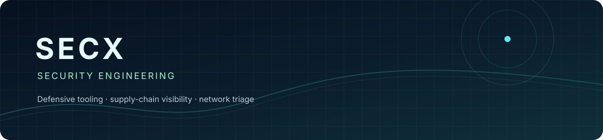

# Secx · security engineering

  
  
  

<strong>Defensive security tooling · reproducible evidence · authorized research</strong>

  <a href="#featured-projects">Projects</a> ·
  <a href="https://code-workspace.top/">Blog</a> ·
  <a href="#collaboration">Collaboration</a>

Read-only by default · local fixtures first · explicit authorization boundaries

Security-focused tooling for defensive review, supply-chain visibility, and
network triage. Every project is designed to be read-only by default, safe to
run on local fixtures, and explicit about authorization and false positives.

## What this profile is about

The repositories are intentionally small and composable: `headerlint` produces
an HTTP baseline, `lockwatch` checks dependency evidence, and `dnswatch` adds
offline network-triage signals. Their reports can be reviewed independently or
attached to a single authorized assessment record. The profile links to live
repositories and releases; it does not mirror contribution totals or invent
activity.

## Featured projects

| Project | Focus | Release | Live stars |
| --- | --- | --- | --- |
| [headerlint](https://github.com/Secx1/headerlint) | HTTP security-header auditing with JSON/SARIF output | [v0.1.0](https://github.com/Secx1/headerlint/releases/tag/v0.1.0) |  |
| [lockwatch](https://github.com/Secx1/lockwatch) | Read-only dependency lockfile scanning with optional OSV lookup | [v0.1.0](https://github.com/Secx1/lockwatch/releases/tag/v0.1.0) |  |
| [dnswatch](https://github.com/Secx1/dnswatch) | Offline Zeek DNS triage with explainable heuristics | [v0.1.0](https://github.com/Secx1/dnswatch/releases/tag/v0.1.0) |  |
| [ssrf-probe](https://github.com/Secx1/ssrf-probe) | Authorized SSRF probes with response analysis and OAST fixtures | [repository](https://github.com/Secx1/ssrf-probe) |  |
| [rebuff](https://github.com/Secx1/rebuff) | Prompt-injection detection research fork | [repository](https://github.com/Secx1/rebuff) |  |

## Activity

GitHub owns the contribution graph and activity counts shown on the [profile
overview](https://github.com/Secx1?tab=overview). This page only links
to those live metrics; it does not mirror or manufacture contribution totals.
GitHub's public stargazer list is now restricted, so the star badges above link
to each repository page rather than the `/stargazers` view.

## Collaboration

Issues and focused pull requests are welcome. Please use synthetic fixtures
for tests and only analyze systems, logs, and URLs you are authorized to
inspect. See each project's `SECURITY.md` and `CONTRIBUTING.md` for details.
